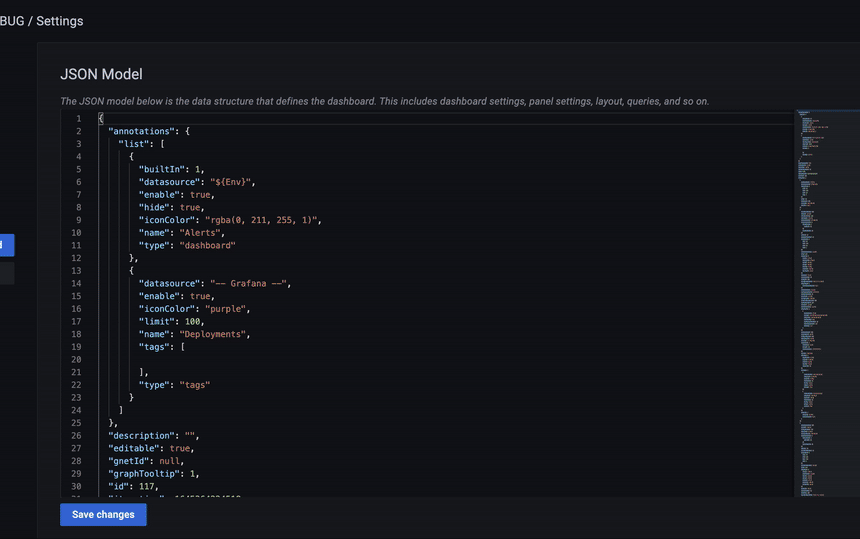

# Grafana → Datadog

This repository is the source code of [this](https://grafana-to-datadog.pages.dev/) simple website.

It is a small utility which runs entirely in your browser for converting Grafana's [Dashboard JSON model](https://grafana.com/docs/grafana/latest/dashboards/json-model/) to a [Datadog dashboard](https://docs.datadoghq.com/dashboards/graphing_json/).

It uses a PromQL parser generated from [this project](https://github.com/kutacoder/promql-parser) to parse the PromQL queries in the panels and convert them to Datadog queries.

